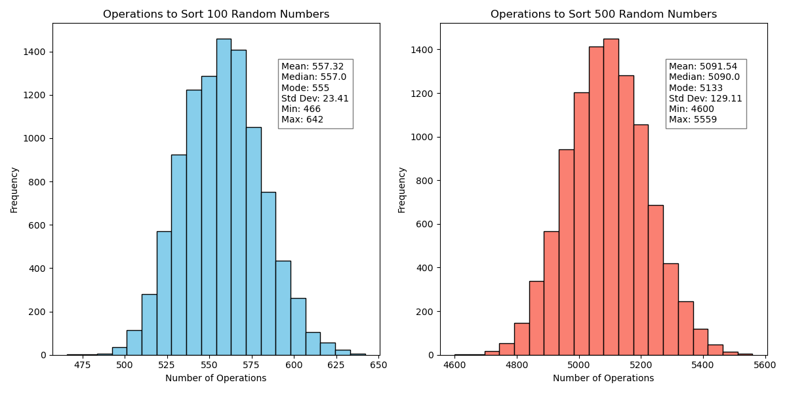

# Push Swap: Sorting stacks.

## Words:
I don't enjoy this project.

Push Swap aims to sort a stack of numbers in the least ammount of operations, from a limited set of instructions.
I decided to go with a "optimized" insertion sort, a bad choice I only found out later, but I will definitly redo this at a point in the future.
I have barely scraped a pass here, but it is really really close, sadly though I dont think there is much more optimization I can do here, I just need to restart with a different strategy, which I will no doubt be procrastinating for a while.

Here is what my stats look like:

That's 10000 runs with 100 random unique numbers and 10000 runs with 500 random unique numbers.

Oh and also I parse the inputs backwards so this is technically a fail XD.

# To Do
- Fix parsing order.
- Delete everything and start over.
